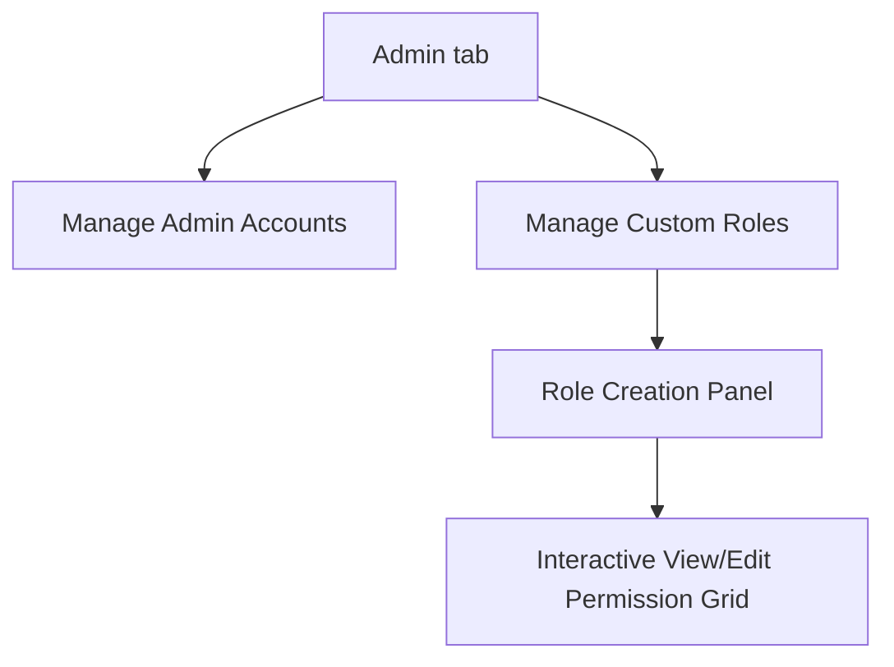

# Implementation Plan - Hierarchical Role-Based Access Control (RBAC)

This plan outlines the design and implementation of a comprehensive, multi-layer **Role-Based Access Control (RBAC)** module. It enables system administrators to define custom roles, select exact view/edit permissions across all app categories using checkboxes, and assign these roles to invited administrators.

---

## 💾 Database Schema Design

### 1. Custom Roles (`roles-db.json` / `admins-db.json` field)
We will introduce a persistent roles database storing custom roles and their hierarchical permissions.

```typescript
export interface RolePermission {
  view: boolean;
  edit: boolean;
}

export interface CustomRole {
  name: string;        // e.g., "HR Assistant", "Auditor"
  description: string; // e.g., "Manages attendance, views salary"
  permissions: {
    employees: RolePermission;
    salary: RolePermission;
    ledger: RolePermission;
    attendance: RolePermission;
    leave: RolePermission;
    birthdays: RolePermission;
    directory: RolePermission;
    admin: RolePermission;
  };
}
```

* **Admins Entry updates**:
  Admins in `admins-db.json` will now carry a `role: string;` field (e.g. `"admin"` for super-admins, or the name of a custom role).
* **Super-Admin fallback**: The default `"admin"` user is treated as a **Super-Admin** with full `view: true` and `edit: true` across all modules.

---

## 🛠️ Backend API Endpoints

We will implement the following endpoints in `server.ts`:
1. **`GET /api/roles`**: Fetches the list of all created roles.
2. **`POST /api/roles`**: Creates a new custom role with its view/edit permissions grid.
3. **`DELETE /api/roles/:name`**: Removes a custom role.
4. **`POST /api/admins/invite` updates**: Accepts a `role` parameter to bind the new user to a specific custom role.
5. **`GET /api/admins/profile` / Login updates**: Exposes the user's role and permission mapping in the authenticated response so the frontend can reactively apply lockouts.

---

## 🎨 Premium UI Designs & Interactive Control Grid

We will build an interactive **Role Management Dashboard** inside the **Admin** sidebar tab:



### 1. Create & Edit Roles Panel
A detailed checkboxes table displaying:
* **Feature Module Name** (e.g., Attendance, Salaries, Employee DB)
* **View Permission** checkbox (Enables/disables viewing module tab in sidebar)
* **Edit/Save Permission** checkbox (Enables/disables buttons like edit modal inputs, delete buttons, imports, daily marking inputs)

### 2. Tab Access Lockout Matrix (Dynamic Access Controls)
When a user logs in:
1. **Sidebar Menu**: If a module's `view` permission is disabled, its menu button is completely hidden from the sidebar.
2. **View-Only Mode**: If `view` is enabled but `edit` is disabled:
   * **Employee Database**: The "Add Employee", "Edit", and "Delete" buttons are disabled.
   * **Attendance Grid**: The dropdown selects are disabled, rendering only read-only statuses. Bulk markings are locked.
   * **Advance & Penalty / Salary Sheets**: All perk inputs, double-click edits, save transactions, select actions, and CSV/PDF exporters are locked or view-only.

---

## 🔬 Verification Plan

### Build Verification
- Run `npm run build` to verify compiling is clean with zero TypeScript errors.

### Manual Verification
1. **Creating Custom Roles**:
   * Navigate to the **Admin** tab. Go to the new **Custom Roles** tab.
   * Click **Create Custom Role**. Name it `"HR Assistant"`.
   * Under the grid checkboxes:
     * Check **View** and **Edit** for **Attendance** and **Employees**.
     * Check **View** only (and uncheck **Edit**) for **Salary** and **Advance & Penalty**.
     * Uncheck **View** entirely for **Leave** and **Admin**.
   * Click **Save Role**.
2. **Inviting a User**:
   * Navigate to **Invite New Admin** in the Admin panel.
   * Enter username `"assistant"`, password `"pass123"`, and select `"HR Assistant"` from the new role dropdown select.
   * Click **Invite**.
3. **Login and Access Lockout Checks**:
   * Logout from super-admin. Login as `"assistant"`.
   * **Sidebar Check**: Confirm that **Leave requests** and **Admin** tabs are hidden from the sidebar.
   * **Registry Check**: Navigate to **Employees**. Verify you can view details and edit them.
   * **Attendance Check**: Navigate to **Attendance**. Verify you can mark daily cells.
   * **Salary Sheet Check**: Navigate to **Salary**. Verify you can view calculations, but double-click perk inputs and Edit buttons are disabled.
